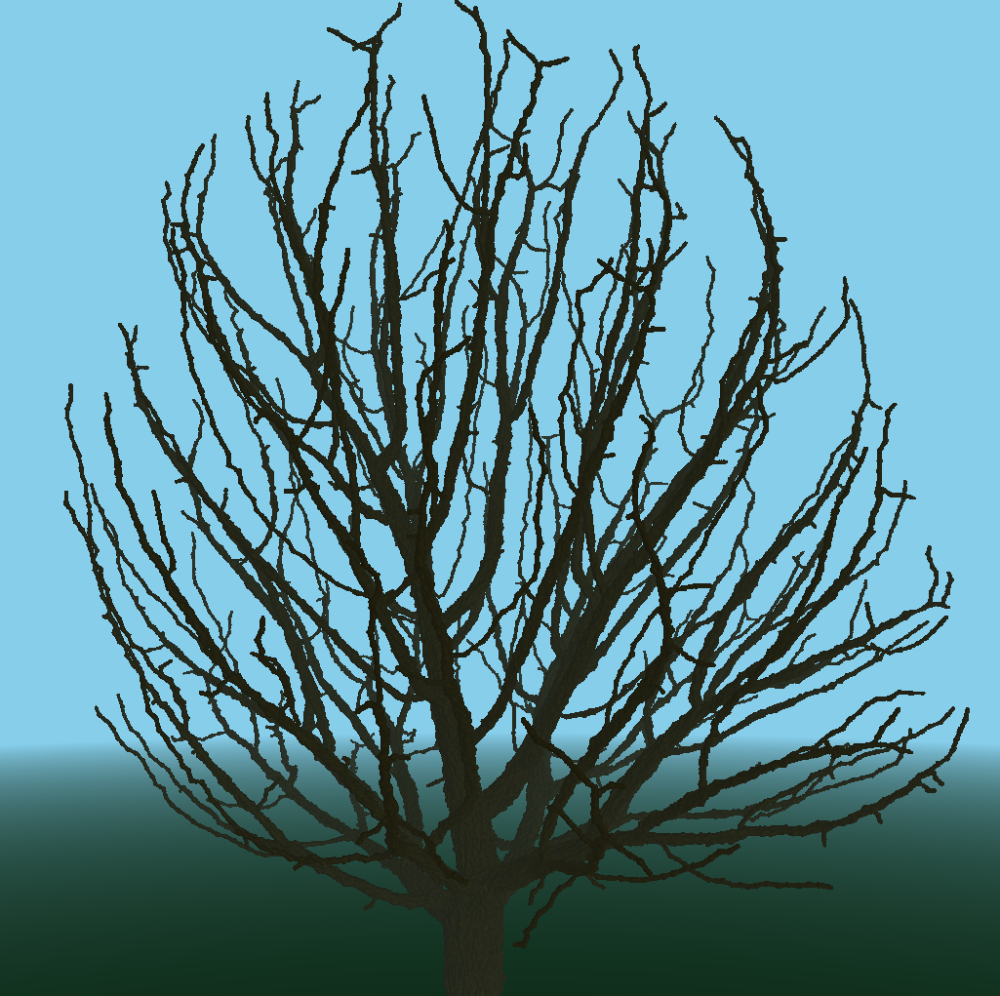

# Implementation of Ned Greene's Voxel Automata Tree Detailing Algorithm

### TODO:
- Calculate Strand Parameters given skeleton
- Better Rendering
- Parallelization?

### Note:
- oak4_4.data and bush_ra17.data crash right now
