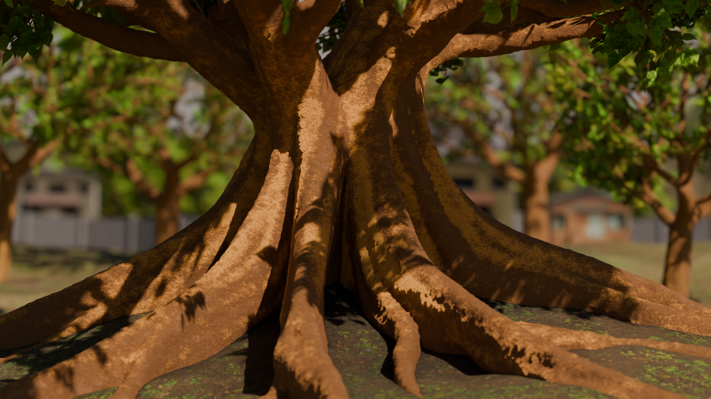

# Using Implicit Line Primitives to Create Tree Geometry

Cover generated using this program, and rendered in Blender.

This program takes in a volume-less 3d tree skeleton, and a set of parameters
and creates a voxel representation of the skeleton, with smoothly blended
junctions, and correct thickness of branches.

This is done by running a series of implicit line primitives along the
skeleton. These primitives collide and blend with one another, thus building
up the thickness of the branches lower on the tree.

## Building And Running
This Program has only been tested on Linux. imagemagick is required for
screenshotting

**To Build:** create a `build` folder, and run `cmake ..` and `make` while 
inside the `build` folder.

**To Run:** execute `./tree_strands <options.json>`. You can find a set of
pretested `options.json` files in `resources/options`. If you would like to
tweak the options, you can do so directly through a text editor, or using 
the [`tree_panel` program](https://github.com/ayylol/tree_panel)

## Usage
Once the program completes generating the tree you can look at it by moving
the camera with the keyboard.

- WASD    -> Panning the camera
- IJKL    -> Rotating the camera
- UO      -> Zoom in/out
- R       -> Reset Camera

You Can also toggle the various display modes by using the number keys.
- 1: The tree model
- 2: The scalar field generated from the implicit primitives
- 3: The strands that define the implicit line primitives
- 4: The normals of the tree model surface
- 5: The input tree skeleton
