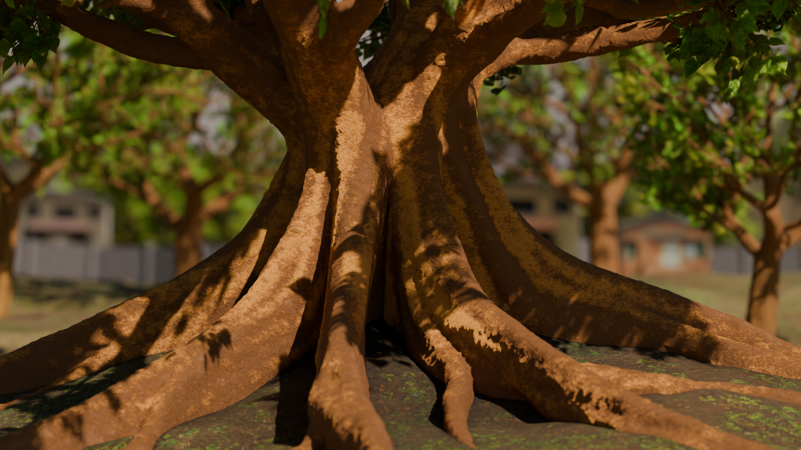

# Using Implicit Line Primitives to Create Tree Geometry

Tree generated using this program, and rendered in Blender.

Visualization of the implicit strands being added iteratively.

This program takes in a volume-less 3d tree skeleton, along with a set of 
parameters to create an implicit field representing the tree. The extracted
iso-surface of the tree mesh will automatically have smoothly blended junctions,
and appropriate thickness of branches.

This is done by running a series of implicit poly-line primitives along the
skeleton. These primitives collide and blend with one another, thus building
up the thickness of the branches lower on the tree. Because each portion of
the tree is made up of many implicit strands complex and arbitrary branching
junctions are dealt with automatically with no need for special cases. Other
complex forms can also be created by playing with parameters, like wall-shaped
buttress roots.

## Building And Running
This Program has only been tested on Linux. imagemagick is required for
screenshotting

**To Build:** create a `build` folder, and run `cmake ..` and `make` while 
inside the `build` folder.

**To Run:** execute `./tree_strands <params.json>`. You can find a set of
pretested `params.json` files in `resources/trees`. If you would like to
tweak the options, you can do so directly through a text editor, or using 
the [`tree_panel` program](https://github.com/ayylol/tree_panel)

## Usage
Once the program completes generating the tree you can look at it by moving
the camera with the mouse or keyboard.

- WASD/M-mouse    -> Panning the camera
- IJKL/L-mouse    -> Rotating the camera
- UO/Scroll Wheel -> Zoom in/out
- R               -> Reset Camera
- EQ              -> Change Camera Sensitivity
- .               -> Cycle predefined cameras (defined in the options files)

You can export the mesh or take screenshots.

- \        -> export mesh
- <Enter>  -> take screenshot (Requires imagemagick)

The mesh can be generated after strands are placed:
- p        -> generate mesh

You Can also toggle the various display modes by using the number keys.

- 1: The tree model
- 2: The strands that define the implicit line primitives
- 3: The texture strands that add texture to the isosurface
- 4: Visualization for strand extension steps
- 5: The input tree skeleton

Different sets of strands can be visualized in the strand visualization mode.

- ;'    -> advance or retreat the lower bound of strands visualized
- []    -> advance or retreat the upper bound of strands visualized

The visualization of strand extension steps can be advanced/retreated. This
mode visualizes the steps for the earliest currently visible strand.

- zx    -> advance or retreat the strand extension visualization

When using an options file with more than one intermediate stage you can
advance the stage.

- n     -> see the next tree stage
